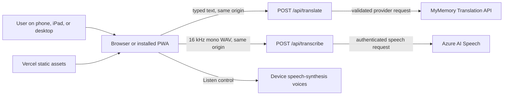
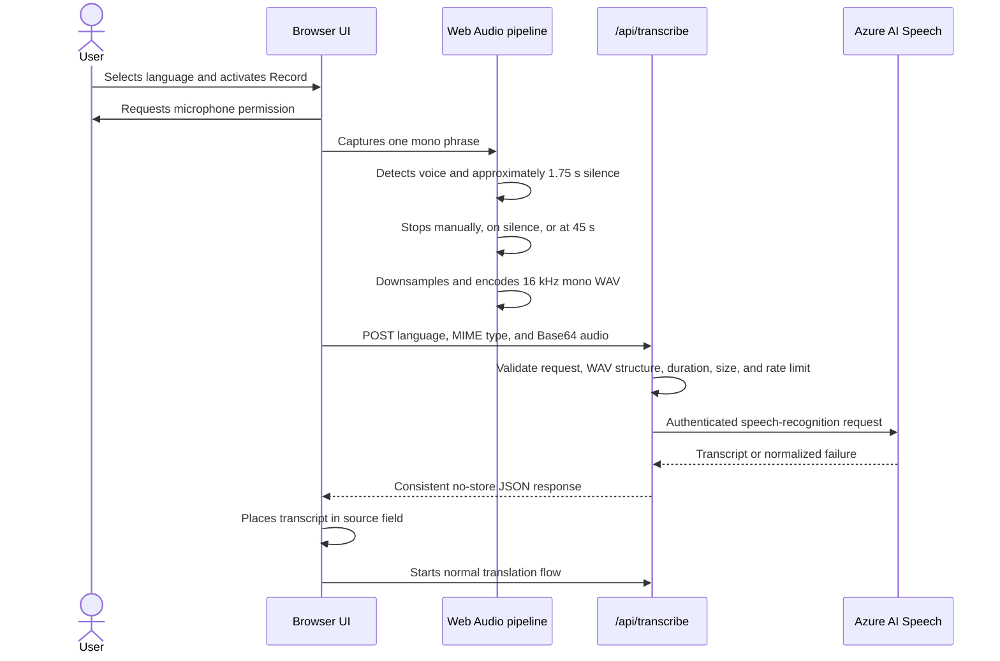
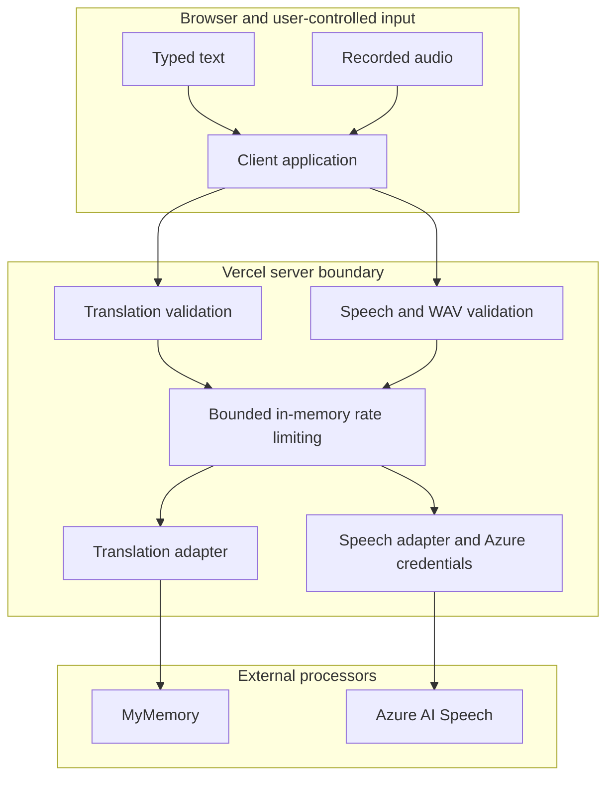
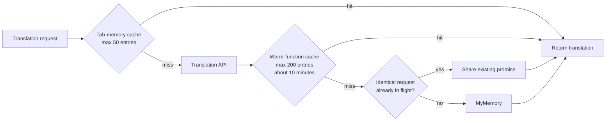
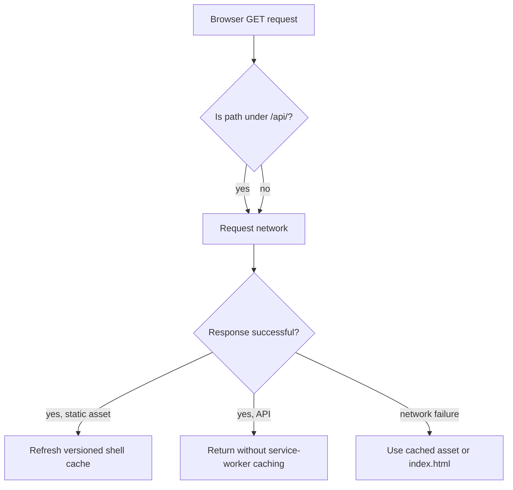
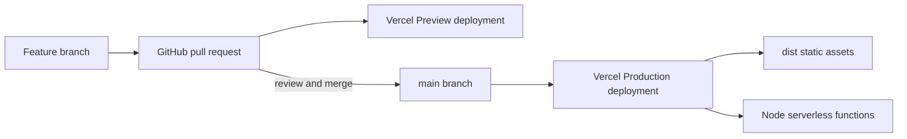

# Lingua Live Architecture

## Purpose

This document describes the production architecture of Lingua Live, the reasoning behind its technology choices, its runtime request flows, and the boundaries that keep translation and speech providers replaceable.

Lingua Live accepts typed or recorded Hebrew, Spanish, or English and returns both remaining languages. It is deployed from GitHub to Vercel as a responsive Progressive Web App (PWA).

## Architecture at a glance



The browser never calls MyMemory or Azure directly. It communicates with same-origin Vercel Functions, which validate input, apply rate limits, protect provider credentials, normalize errors, and call the appropriate provider adapter.

## Technology stack

| Layer | Technology | Responsibility |
| --- | --- | --- |
| Interface | Semantic HTML5 | Document structure, controls, language metadata, and accessibility relationships |
| Presentation | Modern CSS | Responsive layout, RTL/LTR presentation, focus indicators, touch targets, safe areas, and reduced-motion support |
| Client logic | Native JavaScript ES modules | Translation state, request cancellation, recording, copy, speech synthesis, installation, and offline state |
| PWA | Web App Manifest and Service Worker | Installation, application-shell caching, offline interface fallback, and cache cleanup |
| API | Node.js Vercel Functions | Same-origin translation and transcription endpoints |
| Translation | MyMemory adapter | Hebrew, Spanish, and English machine translation |
| Speech recognition | Azure AI Speech adapter | Short-phrase speech-to-text in the selected language |
| Speech playback | Web Speech API | Text-to-speech using voices installed on the device |
| Build | Node.js build script | Copies reviewed static assets from `public/` into `dist/` |
| Verification | Node test runner and repository scripts | Behavioral tests, lint checks, syntax checks, and production build validation |
| Delivery | GitHub and Vercel | Version control, pull-request review, preview deployments, HTTPS, static hosting, and serverless execution |

## Why this framework was selected

Lingua Live intentionally uses the browser platform rather than React, Vue, Angular, or another client framework. In this project, “framework” means a small platform architecture built from native web standards plus Vercel Functions.

This approach was selected because:

- The product has one focused screen and a small, explicit state model.
- Native controls and semantic HTML provide a strong accessibility foundation with less abstraction.
- There is no client-side routing, account system, dashboard, or large component hierarchy that requires a framework runtime.
- A dependency-free frontend reduces JavaScript payload, installation time, supply-chain exposure, and upgrade maintenance.
- Native ES modules are supported by the targeted modern phone, iPad, tablet, and desktop browsers.
- Static assets load quickly and remain straightforward for the service worker to cache safely.
- Vercel Functions provide the required server boundary without maintaining a long-running server.
- Provider adapters can change independently of the interface.

The tradeoff is that reusable UI components, complex state coordination, and multi-page navigation must be implemented directly. If the product grows into many screens, authenticated user data, collaborative history, or a large design system, adopting a component framework and typed application layer should be reconsidered.

## Repository structure

```text
api/
  translate.js              Translation HTTP endpoint
  transcribe.js             Speech transcription HTTP endpoint
  _lib/
    cache.js                Bounded expiring server-memory cache
    languages.js            Supported language configuration
    provider.js             MyMemory translation adapter
    security.js             Media-type, client ID, and rate-limit utilities
    speech-provider.js      Azure AI Speech adapter
    speech.js               Audio payload and WAV validation
    validation.js           Translation request validation
public/
  index.html                Semantic application shell
  styles.css                Responsive and accessible presentation
  app.js                    Browser orchestration and UI state
  audio.js                  Recording, analysis, resampling, and WAV encoding
  lib.js                    Shared browser-side language and state helpers
  sw.js                     Application-shell service worker
  manifest.webmanifest      PWA metadata
  icons/                    PWA and platform icons
scripts/
  build.mjs                 Static production build
  lint.mjs                  Repository lint checks
  serve.mjs                 Local static preview server
test/                       Behavioral and architecture-focused tests
dist/                       Generated deployment output; not source
vercel.json                 Build, output, caching, and security-header policy
```

## Typed translation flow

```mermaid
sequenceDiagram
    actor User
    participant UI as Browser UI
    participant API as /api/translate
    participant Adapter as Translation adapter
    participant Provider as MyMemory

    User->>UI: Types up to 500 characters
    UI->>UI: Waits 500 ms and cancels obsolete request
    UI->>UI: Checks bounded tab-memory cache
    alt both translations cached
        UI-->>User: Displays cached results
    else one or both translations missing
        UI->>API: POST source, targets, and text
        API->>API: Validate method, JSON, languages, length, and rate limit
        API->>Adapter: Translate missing targets
        Adapter->>Adapter: Check expiring memory cache and in-flight requests
        Adapter->>Provider: Request each uncached language direction
        Provider-->>Adapter: Translation or provider error
        Adapter-->>API: Independent target outcomes
        API-->>UI: Consistent JSON; 200 or partial 207
        UI->>UI: Reject stale request IDs
        UI-->>User: Displays successes and useful errors
    end
```

The client sends both targets in one batch request. The provider layer still treats each direction independently, so one successful translation can be shown when the other provider call fails.

## Speech transcription flow



Only one recording is active at a time. The browser enforces a 45-second and 3 MB limit, and the server validates the audio again rather than trusting the client. At 16 kHz, 16-bit mono, a full 45-second WAV is approximately 1.44 MB and remains safely below the upload ceiling.

## Component and trust boundaries



Important boundary rules:

- Only `he`, `es`, and `en` are accepted.
- Source and target languages must differ.
- Text is limited to 500 Unicode code points.
- Audio format, header fields, size, and duration are validated server-side.
- Provider credentials exist only in Vercel environment variables.
- API responses use `Cache-Control: no-store`.
- User-entered text and audio are never added to the service-worker cache.
- Provider errors are converted into stable, user-safe JSON without stack traces.

## Caching and privacy model



Caching is bounded and temporary:

- The browser cache lives only in the current page session and is not written to `localStorage`, cookies, or IndexedDB.
- The server cache exists only in memory inside a warm serverless instance and can disappear at any time.
- Server cache keys contain a SHA-256 hash of source text rather than the source text itself.
- Failures are not cached.
- The service worker caches only public application-shell files.
- Translation and transcription API requests bypass the service worker completely.

These controls reduce repeated provider usage but do not make the application suitable for confidential or regulated content. MyMemory and Azure remain external data processors.

## PWA and offline architecture

The service worker follows a network-first strategy for same-origin static assets. A successful network response refreshes the versioned shell cache; if the network fails, the cached asset or cached `index.html` is used.



Offline support means the interface can open and explain that connectivity is unavailable. New translation and transcription requests require the internet and are never represented as offline-capable.

## Deployment architecture



`npm run build` recreates `dist/` by copying the reviewed `public/` tree. Vercel serves `dist/` over HTTPS and deploys files under `api/` as Node.js serverless functions. `vercel.json` also applies security headers, prevents API response caching, and forces service-worker revalidation.

The required production secrets are:

- `AZURE_SPEECH_KEY`
- `AZURE_SPEECH_REGION`

`MYMEMORY_EMAIL` is optional for MyMemory attribution, and `TRANSLATION_PROVIDER` defaults to `mymemory`.

## Accessibility architecture

Accessibility is treated as part of the component contract rather than a final visual layer:

- Native buttons and textarea controls support keyboard, touch, mouse, and assistive technology.
- The language selector implements a radio-group pattern with roving `tabindex` and arrow-key navigation.
- Translation panels are labelled keyboard destinations so screen-reader users can inspect both outputs.
- Polite live regions announce network, recording, translation, copy, and installation state changes.
- `lang` and `dir` update with the selected language; Hebrew results use right-to-left presentation.
- Focus indicators, contrast, touch-target sizes, safe-area insets, responsive reflow, and reduced motion are enforced in CSS and tests.
- Automated checks supplement, but do not replace, NVDA, VoiceOver, keyboard-only, zoom, reflow, and device testing.

See [`ACCESSIBILITY.md`](../ACCESSIBILITY.md) for the conformance target and manual test matrix.

## Reliability and scaling characteristics

The current design scales horizontally with Vercel's serverless execution model, but some controls are instance-local:

- Rate-limit counters and translation caches are not shared across serverless instances.
- Cold starts discard cached translations.
- MyMemory public quota and Azure subscription quota remain external limits.
- There is no persistent queue, database, user history, or cross-region coordination.

This is appropriate for a privacy-conscious prototype and modest public traffic. For sustained or business-critical usage, the next architectural steps would be:

1. Replace MyMemory with a provider offering an appropriate service agreement, quota, and operational support.
2. Move rate limiting to a shared edge or managed store.
3. Add privacy-reviewed observability using metadata only, never full text or audio.
4. Add provider health checks, controlled retries, and circuit breaking.
5. Consider streamed or conversational transcription if the product moves beyond short phrases.
6. Introduce a component framework only when product complexity—not fashion—justifies its runtime and maintenance cost.

## Known trade-offs

These are deliberate decisions for a free-tier demonstration, not oversights.

- **Rate limiting is in-memory and per serverless instance.** Counters reset on cold starts and are not shared across concurrent instances, so limits are best-effort. The binding constraint is the providers' daily quotas rather than request volume, and a distributed store such as Redis would add cost and operational surface without protecting anything the quotas do not already bound.
- **Client identity trusts platform-sanitized headers.** Request identity comes from forwarding headers that Vercel's edge sets and sanitizes. Self-hosting behind a different proxy would require revisiting the header handling in `api/_lib/security.js`.
- **The same-origin gate is quota protection, not authentication.** It blocks drive-by scripts and scanners from spending the shared quotas; a determined client can still forge the headers. There are no accounts, sessions, or user secrets to protect.
- **Provider quotas are pooled.** All visitors share one MyMemory character allowance and one Azure F0 speech allowance. When either is exhausted, the interface degrades to explicit, user-facing quota messages instead of failing silently or retrying.
- **Recording uses ScriptProcessorNode.** It is deprecated in favor of AudioWorklet but remains supported in every current browser. Migration is a planned improvement and does not change the 16 kHz mono WAV contract with the API.

## Architectural decision summary

| Decision | Reason | Revisit when |
| --- | --- | --- |
| Native HTML, CSS, and JavaScript | Small application, fast loading, low dependency risk, direct accessibility | UI grows into many routes or a large reusable component system |
| Vercel static hosting and Functions | Existing GitHub integration, preview deployments, HTTPS, and no server maintenance | Runtime limits, regional requirements, or cost require another platform |
| Same-origin APIs | Keeps credentials server-side and simplifies browser security | External clients require a versioned public API |
| Provider adapters | Prevents provider details from spreading through the UI | Retain this boundary even when providers change |
| Temporary memory caches | Reduces quota usage without persistent user-content storage | Shared caching or higher traffic becomes necessary |
| Native Web Speech playback | No additional service or audio storage | Consistent premium neural voices become a product requirement |
| Network-first application shell | Avoids trapping users on old releases | A richer offline editing model is introduced |

## Verification commands

```bash
npm install
npm run check
npm audit --omit=dev
```

`npm run check` runs linting, JavaScript syntax checks, all behavioral tests, and the production build.
